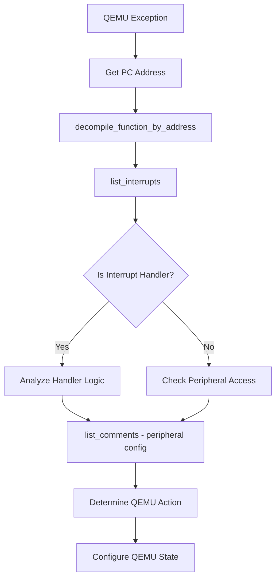
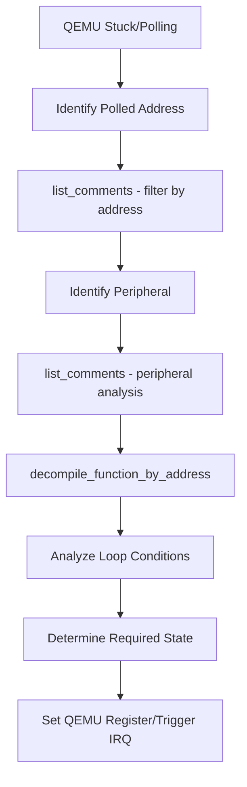
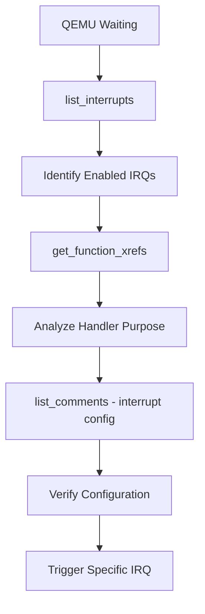
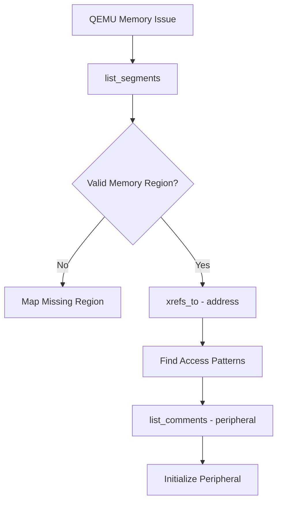
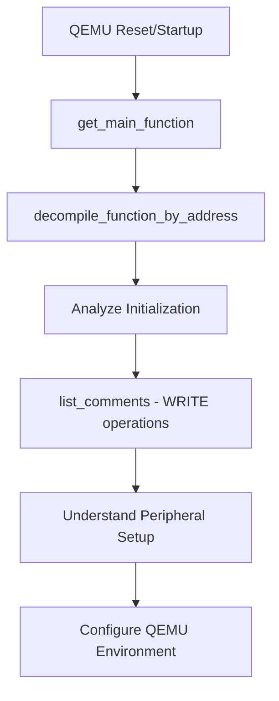

# QEMU + Ghidra MCP Integration Guide

## Overview

This document outlines the complete integration workflow between QEMU dynamic analysis and Ghidra static analysis using Model Context Protocol (MCP) servers. The system enables sophisticated firmware reverse engineering by combining real-time execution analysis with comprehensive static code analysis.

## Architecture

```
┌─────────────┐    MCP     ┌─────────────┐    MCP     ┌─────────────┐
│    LLM      │ ◄────────► │    QEMU     │ ◄────────► │   Ghidra    │
│  Agent      │            │   Server    │            │   Server    │
└─────────────┘            └─────────────┘            └─────────────┘
       │                          │                          │
       │                          │                          │
   Orchestrates              Dynamic Analysis           Static Analysis
   Analysis Flow             • Execution State          • Code Structure
   • Exception Handling      • Memory Access            • Interrupt Config
   • Workflow Decisions      • Register Values          • Peripheral Maps
   • Action Planning         • PC/Stack State           • Cross References
```

## Core Integration Workflows

### Workflow 1: Exception Analysis
**Scenario**: QEMU encounters an exception during execution



**Implementation Steps**:
1. **QEMU Reports**: `"Exception at PC=0x00001234, SP=0x20001000"`
2. **Ghidra Analysis**: `decompile_function_by_address("0x00001234")`
3. **Context Understanding**: `list_interrupts()` to check if this is an interrupt handler
4. **Peripheral Analysis**: `list_comments(filter="0x40001000")` for any register access
5. **Action Planning**: Configure QEMU peripheral state or trigger expected interrupt

### Workflow 2: Stuck/Polling Detection
**Scenario**: Code is stuck in a polling loop waiting for hardware state change



**Implementation Steps**:
1. **QEMU Reports**: `"Code stuck polling 0x40001000"`
2. **Register Identification**: `list_comments(filter="0x40001000")`
3. **Peripheral Context**: `list_comments(peripheral="UART")`
4. **Loop Analysis**: `decompile_function_by_address(PC)`
5. **State Resolution**: Set register value or trigger peripheral interrupt

### Workflow 3: Interrupt Waiting
**Scenario**: Code is waiting for an interrupt that never arrives



**Implementation Steps**:
1. **QEMU Reports**: `"Code waiting, no progress at PC=0x00002000"`
2. **Interrupt Analysis**: `list_interrupts()`
3. **Handler Investigation**: `get_function_xrefs(name="eic_handler")`
4. **Configuration Check**: `list_comments(peripheral="EIC")`
5. **Interrupt Trigger**: Send `"IRQ_27"` to QEMU

### Workflow 4: Memory Access Analysis
**Scenario**: Invalid memory access or unexpected memory behavior



**Implementation Steps**:
1. **QEMU Reports**: `"Invalid memory access at 0x20005000"`
2. **Memory Validation**: `list_segments()`
3. **Access Analysis**: `xrefs_to(address="0x20005000")`
4. **Peripheral Check**: `list_comments(filter="0x20005000")`
5. **Memory Setup**: Map region or initialize peripheral in QEMU

### Workflow 5: Startup Analysis
**Scenario**: Understanding firmware initialization and entry points



**Implementation Steps**:
1. **QEMU Event**: Reset or startup
2. **Entry Point**: `get_main_function()`
3. **Main Analysis**: `decompile_function_by_address(main_address)`
4. **Init Sequence**: `list_comments(filter="WRITE")`
5. **Environment Setup**: Configure QEMU to match expected initial state

## MCP Function Integration Map

### Primary Analysis Functions
| Function | QEMU Input | Ghidra Output | QEMU Action |
|----------|------------|---------------|-------------|
| `decompile_function_by_address` | PC address | C-like code, logic flow | Understand execution context |
| `list_interrupts` | Exception info | IRQ mappings, handlers | Trigger specific IRQ |
| `list_comments` | Memory address | Register details, config | Set peripheral state |
| `get_main_function` | Reset event | Entry point address | Set PC for analysis |

### Cross-Reference Functions
| Function | Purpose | Integration Value |
|----------|---------|-------------------|
| `get_function_xrefs` | Find callers/references | Understand code relationships |
| `xrefs_to` | Memory access analysis | Identify peripheral usage patterns |
| `list_segments` | Memory map validation | Verify QEMU memory configuration |

## Advanced Integration Patterns

### Pattern 1: Peripheral State Synchronization
```python
# QEMU reports peripheral access issue
qemu_address = "0x40001000"
comments = list_comments(filter=qemu_address)
peripheral = comments[0]["peripheral"]  # e.g., "UART"
config = list_comments(peripheral=peripheral)

# Apply configuration to QEMU
for comment in config:
    if comment["operation"].startswith("WRITE:"):
        value = comment["operation"].split(":")[1]
        # Send to QEMU: set_register(peripheral, register, value)
```

### Pattern 2: Interrupt Correlation
```python
# QEMU execution stalled
interrupts = list_interrupts()
for irq in interrupts["results"]:
    if irq["enabled"] and irq["confidence"] == "high":
        # Send to QEMU: trigger_interrupt(irq["irq_number"])
        # Monitor for execution progress
```

### Pattern 3: Code Flow Analysis
```python
# QEMU PC analysis
pc = "0x00001234"
code = decompile_function_by_address(pc)
# Analyze for:
# - Loop conditions (polling scenarios)
# - Function calls (expected subroutines)
# - Memory access (peripheral interactions)
# - Conditional branches (decision points)
```

## Error Handling and Edge Cases

### QEMU Exception Handling
- **Hardware Fault**: Check if code expects specific memory layout
- **Undefined Instruction**: Verify ARM instruction set compatibility
- **Stack Overflow**: Analyze stack usage patterns in functions
- **Invalid Memory**: Check segment mapping and peripheral regions

### Ghidra Analysis Limitations
- **Unknown Functions**: Use address-based analysis when function names unavailable
- **Incomplete Decompilation**: Fall back to assembly-level analysis
- **Missing SVD Data**: Use memory access patterns for peripheral identification

### Integration Timing
- **Synchronization**: Ensure QEMU state matches Ghidra analysis assumptions
- **State Consistency**: Validate that applied changes don't break other functionality
- **Progressive Analysis**: Build understanding incrementally rather than making large state changes

## Best Practices

### 1. Incremental Analysis
- Start with minimal QEMU configuration
- Apply Ghidra insights gradually
- Validate each change before proceeding

### 2. State Correlation
- Always cross-reference QEMU PC with Ghidra analysis
- Verify memory layouts match between environments
- Check peripheral configurations for consistency

### 3. Workflow Documentation
- Log all analysis steps and decisions
- Document successful patterns for reuse
- Maintain correlation between QEMU events and Ghidra findings

### 4. Error Recovery
- Implement rollback mechanisms for failed state changes
- Provide alternative analysis paths when primary methods fail
- Maintain debugging traces for complex scenarios

## Conclusion

The QEMU + Ghidra MCP integration provides a powerful framework for automated firmware reverse engineering. By combining dynamic execution analysis with comprehensive static analysis, this system can automatically diagnose execution issues, understand code behavior, and apply targeted fixes to advance firmware analysis.

The key to successful integration lies in understanding the bidirectional relationship between execution state (QEMU) and code structure (Ghidra), using each system's strengths to compensate for the other's limitations.